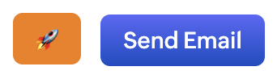
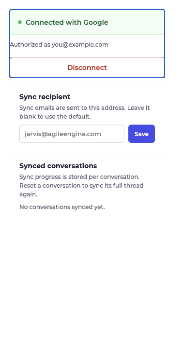

# Jarvis Sync

A Chrome extension (Manifest V3) that bridges the gap between two of your daily
tools — **LinkedIn messaging** and **Zoho CRM** — by way of an email-based sync
to **Jarvis** (`https://jarvis.agileengine.com`).

## Why does this project exist?

Jarvis is the company's CRM, but conversation work happens in two other places:
LinkedIn message threads and Zoho CRM contact records. Manually copying every
exchange into Jarvis is slow, error-prone, and easy to forget.

This extension automates that, in two directions:

1. **LinkedIn → Jarvis.** From a LinkedIn conversation thread, send the thread
   (or just the new messages since your last sync, or a hand-picked selection)
   into Jarvis with one click. The email is sent from **your own Gmail account**
   so Jarvis sees it as coming from you.
2. **Zoho → Jarvis.** On a Zoho CRM contact page, an orange rocket button next
   to "Send Email" opens the matching contact in Jarvis directly — no hunting
   for the right record.

## Features

- **One-click sync** of a LinkedIn conversation to Jarvis via Gmail (`gmail.send` scope).
- **Watermark-based incremental sync** — the extension remembers the last
  synced message per contact, so re-syncing only sends what's new.
- **Scope selection** — sync the full conversation, only new messages, or a
  **manually selected subset** (selection mode).
- **Gmail draft fallback** — if Google auth fails, it opens a pre-filled Gmail
  compose draft for manual review; the watermark only advances after you
  confirm the send.
- **Sync history** in the popup — see what was synced and when, and reset sync
  progress for any contact.
- **Zoho contact redirect button** — a branded orange rocket that jumps from a
  Zoho contact record to the same contact in Jarvis.
- **SPA-aware content scripts** — both LinkedIn and Zoho render as single-page
  apps; the extension survives navigation, re-renders, and dynamic DOM churn.

## Screenshots

**Zoho → Jarvis.** On a contact page, the orange rocket button sits right next
to Zoho's "Send Email" action and opens the same contact in Jarvis.



**Extension popup.** Connect/disconnect Google, change the sync recipient (no
rebuild needed), and review or reset sync history per conversation.



## Using it

### Sync a LinkedIn conversation to Jarvis

1. Open a conversation thread on LinkedIn Messenger.
2. Click the **Sync to Jarvis** button that appears above the message box.
3. Pick a scope in the dropdown:
   - **Entire thread** — everything in the conversation.
   - **Since last sync** — only the messages after your last sync (uses the
     watermark).
   - **Time windows** (today / last 24 hours / last week) — only messages in
     that window.
   - **Select messages** — tick individual messages, then sync just those.
4. The conversation is emailed to the sync recipient from your Gmail account.
   On success you'll see **"Synced to Zoho."**; on an auth problem the
   extension opens a pre-filled Gmail draft — after you send it, hit
   **Confirm sent** so the progress watermark advances.

### Jump from Zoho to Jarvis

1. Open any contact in Zoho CRM.
2. Click the orange **🚀** button to the left of "Send Email".
3. The matching contact opens in Jarvis in a new tab.

### Change where syncs are sent

Open the extension popup → **Sync recipient** → type an email → **Save**.
Leave the field blank and save to reset to `jarvis@agileengine.com`.

## How it works

```
┌─ LinkedIn tab ──────────────────────────────┐
│ content script                              │
│  · detects conversation thread (stable,     │
│    debounced MutationObserver)              │
│  · renders "Sync to Jarvis" button + scope  │
│    dropdown / selection mode                │
│  · extracts messages, filters by scope +    │
│    watermark                                │
│  · composes an email envelope               │
└──────────────┬──────────────────────────────┘
               │ chrome.runtime.sendMessage (SEND_SYNC_EMAIL)
┌──────────────▼──────────────────────────────┐
│ background (MV3 service worker)             │
│  · chrome.identity OAuth → Gmail token      │
│  · builds RFC-5322-style raw message        │
│  · POST gmail.googleapis.com/.../messages/send
│  · dedupes in-flight syncs per contact      │
│  · classifies errors (auth vs retryable)    │
│  · advances the watermark on success        │
└─────────────────────────────────────────────┘
```

The email that Jarvis receives is a plain-text envelope built by
`src/shared/composer.ts`, addressed to `jarvis@agileengine.com` (overridable —
see [Configuration](#configuration)), containing the contact, who you are,
the chosen scope, and the conversation messages.

### Key mechanisms

- **Watermarks** (`src/background/watermark.ts`) — stored in
  `chrome.storage.local`, keyed per contact URL. Each entry is
  `{ fingerprint, syncedAtEpochMs }` where `fingerprint` is the SHA-256 of the
  last synced message, so incremental sync can tell exactly where you left off.
- **Message fingerprinting** (`src/shared/fingerprint.ts`) — stable content
  hashes used by the watermark and to keep the "already synced" math honest.
- **Content-script stability** — LinkedIn's thread detection requires two
  consecutive identical detections before mounting the button, and uses roster
  signatures to avoid remounting on unrelated DOM churn. URL changes (including
  `pushState`/`replaceState`) tear everything down cleanly.
- **Zoho button** (`src/content/zoho-jarvis-button.ts`) — locates Zoho's
  "Send Email" control (which is a `<button>`, not an `<a>`), copies its
  computed styles, re-themes it to the Jarvis orange, and inserts the rocket
  link *before* it. Removal is driven purely by the URL to avoid stutter during
  Zoho's re-renders. A capture-phase `stopImmediatePropagation` guard keeps
  Zoho's "Send Email" click handler from firing when you click the rocket —
  the new-tab navigation still works.
- **URL mapping** (`src/shared/zoho-url.ts`) — pure function mapping a Zoho
  contact record URL to its Jarvis equivalent, or `null` when the page isn't a
  contact detail page.

## Repository layout

```
entrypoints/
  background.ts        MV3 service worker: OAuth, Gmail send, watermarks, drafts
  content.ts           LinkedIn content script (thread detection + sync UI)
  zoho.content.ts      Zoho CRM content script (rocket redirect button)
  popup/               Extension popup: connect/disconnect Google, sync history
src/
  content/             DOM logic for the LinkedIn and Zoho content scripts
  background/          Chrome-side logic (watermark storage)
  shared/              Pure, unit-tested logic: composer, scopes, fingerprint,
                       watermark, zoho-url, messages, errors, scope-filter
scripts/
  validate-manifest.mjs  Post-build manifest sanity checks (see CI-ish gate below)
public/icon/           Rocket extension icons (16/32/48/96/128)
assets/rocket-icon.svg Source of the rocket icon
```

The split is intentional: everything in `src/shared` is framework-free and
plainly unit-testable; `src/content` and `src/background` hold only the parts
that need the DOM or `chrome.*` APIs.

## Getting started

Requirements: **Node.js ≥ 22** and npm.

```bash
npm install
npm run dev          # watch mode — loads the unpacked extension in Chrome
```

To load it:

1. Open `chrome://extensions` and enable **Developer mode**.
2. Click **Load unpacked** and select `.output/chrome-mv3`.
3. Sign in to Google from the extension popup (grants `gmail.send`).

Other commands:

```bash
npm run build           # production build → .output/chrome-mv3
npm run zip             # build + package a distributable zip
npm run test            # run the unit/DOM test suite (Vitest)
npm run test:watch
npm run typecheck       # tsc --noEmit
npm run validate:manifest  # post-build manifest sanity checks
```

## Installing for users

The extension isn't on the Chrome Web Store, so it's installed as an **unpacked
extension** from a built zip. Works in Chrome and any Chromium browser (Edge,
Brave, Opera).

### Option A — install from a GitHub Release (no build required)

1. Open the **Releases** page and download the latest
   `linkedin-jarvis-extension-<version>-chrome.zip`.
2. Unzip it to a folder you'll keep in place (e.g. `~/jarvis-extension`).
   The unzipped folder must contain `manifest.json` at its top level.
3. Open `chrome://extensions` and turn on **Developer mode** (top-right).
4. Click **Load unpacked** and select that folder.
5. Pin **Jarvis Sync** from the puzzle-piece menu so the popup is easy to reach.

> **Important:** don't move or delete the unzipped folder after installing —
> an unpacked extension runs from where it was loaded. If you move it, remove
> and re-add it from the new location.

### Option B — install from source (for developers)

```bash
git clone https://github.com/lucas-vidmar/jarvis-linkedin-chrome-extension.git
cd jarvis-linkedin-chrome-extension
npm install
npm run build
```

Then open `chrome://extensions`, enable **Developer mode**, click **Load
unpacked**, and select the `.output/chrome-mv3` folder.

### After installing

1. Open the popup (puzzle-piece menu → **Jarvis Sync**) and click
   **Connect with Google** — this grants the `gmail.send` scope used for syncs.
2. (Optional) Set a **Sync recipient** in the popup if syncs shouldn't go to
   `jarvis@agileengine.com`.
3. Open a LinkedIn conversation and look for **Sync to Jarvis** above the
   message box. Open a Zoho contact and look for the **🚀** button next to
   "Send Email".

### Updating

There's no auto-update for unpacked extensions. To update:

- **Release install:** download the new zip, unzip over the existing folder,
  then hit the refresh icon on the extension card in `chrome://extensions`
  (or remove and re-add it).
- **Source install:** `git pull && npm run build`, then reload the extension.

### Notes for distribution

- Because the extension isn't in the Web Store, Chrome shows a
  "developer mode extensions" warning on startup. It's harmless — just dismiss
  it.
- `chrome.identity` OAuth is tied to the extension's Google Cloud client.
  It works out of the box for a single user signing in with their own Google
  account, but if you plan to distribute it to other people who will sign in
  with *their own* accounts, the OAuth client must first be published and
  verified in Google Cloud Console, or their sign-in will be rejected.

## Configuration

`gmail.send` OAuth is configured via `chrome.identity` (the client ID lives in
`wxt.config.ts`).

**Sync recipient** — runtime-configurable, no coding or rebuild needed. Open the
extension popup → **Sync recipient**, enter any email address, and hit **Save**.
It's stored in `chrome.storage.sync`, so the setting persists across restarts and
roams with your Chrome profile. Leave the field blank and save to reset to the
default (`jarvis@agileengine.com`).

For development, the *factory default* (used on fresh installs / when nothing is
saved) can be overridden at build time via a `.env` file copied from
`.env.example`:

```bash
WXT_JARVIS_RECIPIENT=you@example.com
```

The popup setting always wins over the build-time value at runtime.

## Testing

- **Pure logic** (`src/shared/*.test.ts`) — composer, scopes, scope filter,
  fingerprint, watermark, and the Zoho URL mapper.
- **DOM behavior** (`src/content/*.test.ts`) — the Zoho button logic runs under
  a DOM implementation (happy-dom) with real computed-style assertions.
- The LinkedIn content script is written to be stable against selector drift;
  both content scripts were validated live (real LinkedIn/Zoho pages) during
  development.

`npm run validate:manifest` asserts the things Chrome is picky about that are
easy to break in a build: the full `gmail.send` scope URI, the `identity`
permission, and the required host permissions.

## Notes & caveats

- Both content scripts rely on LinkedIn/Zoho DOM structure, which can change
  without notice. Detection is written defensively (debounced observers,
  stability passes, URL-driven lifecycle), but a major upstream redesign may
  require updating selectors.
- The Zoho button copies the "Send Email" button's computed styles and overrides
  them with the Jarvis orange — Zoho's gradient background is stripped so the
  color holds at rest, hover, and pressed.
- Only `gmail.send` is requested — the extension reads nothing from your inbox
  and can't read messages back.

## License

[MIT](LICENSE)